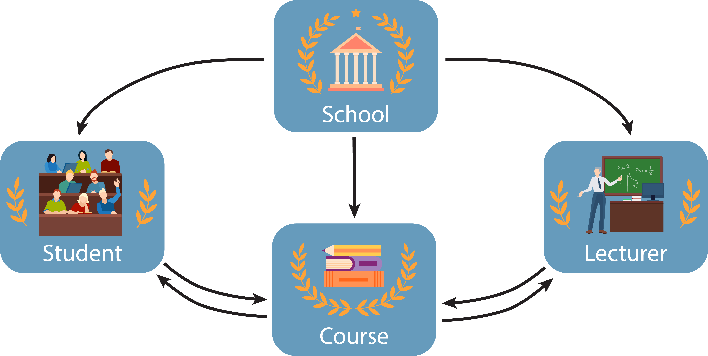
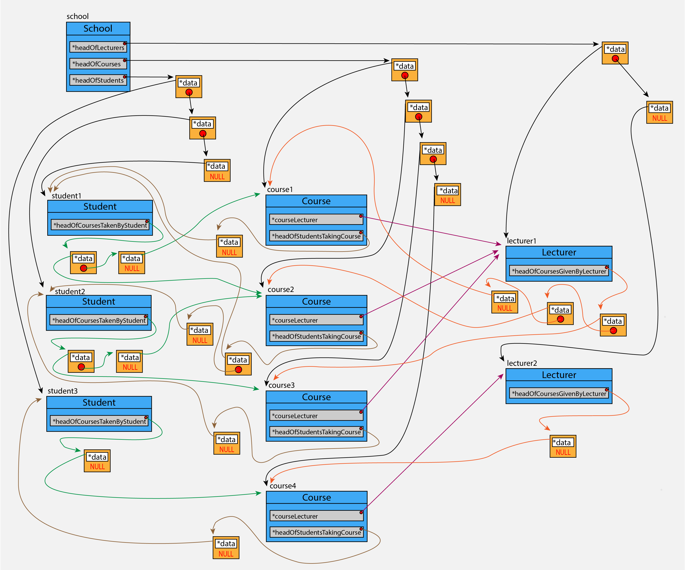

  

# EOOP - Object-Oriented Programming

This repository contains Term Project <i>(Preliminary Project and Code in C++)</i> for the <b>EOOP Course</b> given by 
Warsaw University of Technology in the 2024 spring term.

 

## Description of the Project

### Keyword: School

In this project, I was given “School” as the keyword. The classes that will be used in the
project and the relationships between them were determined with the “School” keyword.

### Classes and Relations Between Them

<b>School</b> is a comprehensive organization consisting of many bodies established for education
and training purposes. The main organs of this organization are the <b>“Student”</b> receiving education,
the <b>“Lecturer”</b> providing education, the <b>“Course”</b> as the education-training channel between the
student and the lecturer, and the “School”, which includes all these as well as carrying out
administrative activities.

As a result, this organization will be represented by these 4 interconnected classes. 
- School
- Lecturer
- Student
- Course

  

<i>Figure 1: Classes and Relations Between Them</i>

## Limits, Restrictions and Assumptions

### Limits
1. Each lecturer can give a maximum of 3 courses.
2. There can be a maximum of 10 students enrolled in each course.
3. Each course can have only 1 lecturer.
4. A course can have a minimum of 1 credit and a maximum of 4 credits.

### Restrictions
1. Student number is unique and cannot be changed later.
2. A second course cannot be created with the same course name or course code.

### Assumptions
1. There may be no students registered for the course.
2. If a teacher teaching a course is fired (and the course instructor has not been updated
   previously), the students involved will be removed from the course and the course will
   disappear.
3. If the student is unregistered from the school, his enrolments will also be deleted from all
   courses in which he is enrolled.
4. If a course is removed by the school, the student's course records and the relationship
   between the lecturer and the course are also deleted. 

## Memory Map

  

<i>Figure 2: Memory Map</i>

Figure 2 shows the instances of schools, students, lecturers and course classes in the
organization and the relationship between them.

Blue boxes represent instances. The part written in large font in the box indicates which
class the object is. The text outside and just above the blue boxes shows the name of the object.

The gray boxes within the blue boxes represent the pointer and show the first element of the
single-linked list (the pointer in the Course class does not show this because it points directly to the
object since each course will have a single lecturer).

Yellow boxes indicate single-linked list elements. The white box inside represents the
pointer named *data and points to the object. The red circle inside represents the pointer named
*next and shows the next element. If there is no element after that element, NULL appears instead
of the red circle.

As seen in Figure 2, there is 1 School, 3 Student, 4 Course, and 2 Lecture instances.

All of them are included in the singly-linked lists pointed by the pointers in the School.

student1 took 2, student2 2 and student3 1 course. The pointer belonging to the instance
points to the beginning of the single linked list that points to the course taken by these students.

1 student took course1, 2 students took course2, 1 student took course3 and 1 student took
course4, and the pointer named *headOfStudentsTakingCourse in the instance is the pointer that
points to the head of the single-linked list that points to the student taking the course.

The pointer named *courseLecturer in the Course points directly to the lecturer without
using a singly-linked list, unlike other pointers. Because only one teacher can teach each course.

lecturer1 teaches course1, course2 and course3. lecturer2 only teaches course4. 

